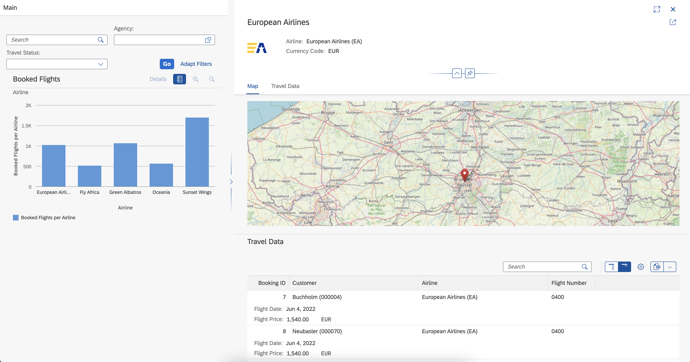

# Devtoberfest 2022

This repository contains the OData service and the final result of the Devtoberfest 2022 session ["Outside the lines: Creating a custom application with open-sourced development tools and the SAP Fiori elements flexible programming model"](https://groups.community.sap.com/t5/devtoberfest/outside-the-lines-sap-fiori-elements-flexible-programming-model/ec-p/8831). Expect that there are small differences between this repository and the application built in the demo, as this reference was created beforehand.

The technical setup is a variation of the one used in [tobiasqueck/ui5con2022](https://github.com/tobiasqueck/ui5con2022).

Note that this is only published for you to revisit the technical details of the demo. The existence of this repository does not promise any current or future functionality. While everything worked great in the demo, it might also no longer work -- if you are still interested to fix this, feel free to open an issue and we can investigate this together.

The maps used in the custom section are taken from [OpenStreetMap](https://www.openstreetmap.org/copyright), which is licensed under the [Open Data Commons Open Database License](https://opendatacommons.org/licenses/odbl/).

## Setup
- If using a local installation of Visual Studio Code, make sure that you have the [SAP Fiori tools](https://marketplace.visualstudio.com/items?itemName=SAPSE.sap-ux-fiori-tools-extension-pack) installed; this should already be there in the SAP Business Application Studio
- Make sure to have `@sap/cds-dk` installed globally: `npm install -g @sap/cds-dk`
- This demo was created using [Easy UI5](https://github.com/SAP/generator-easy-ui5), so this has to be installed to reproduce the generation
  - TypeScript support was enabled with [ui5-community/generator-ui5-project#58](https://github.com/ui5-community/generator-ui5-project/pull/58). If this pull request is not yet merged, feel free to also add your comments to it.
- Install dependencies for the server and the application: `cd server && npm install && cd ../devtoberfest.travel && npm install`
- Start the server `cd server && npm start`
- Open `devtoberfest.travel` in the SAP Business Application Studio or Visual Studio Code and start exploring the project using SAP Fiori tools
